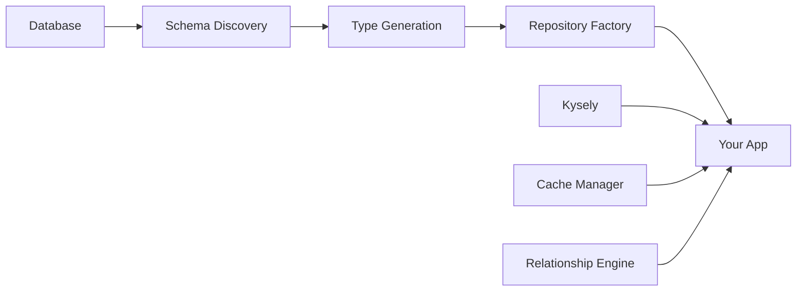

# NOORM - No ORM, Just Magic! ✨

[](https://badge.fury.io/js/noorm)
[](https://www.typescriptlang.org/)
[](https://opensource.org/licenses/MIT)
[](https://nodejs.org/)

> **Zero-configuration pseudo-ORM built on Kysely that automatically discovers your database schema and generates everything you need. No manual entity definitions, no complex setup - just pure magic!**

NOORM (pronounced "No-ORM") is a revolutionary approach to database access that eliminates the complexity of traditional ORMs while providing full type safety and developer experience. Simply connect to your existing database and NOORM does the rest!

## 🎯 Why NOORM?

| Feature | Traditional ORMs | NOORM |
|---------|------------------|-------|
| **Setup** | Complex configuration | Zero configuration |
| **Schema** | Manual entity definitions | Auto-discovered |
| **Types** | Manual type definitions | Auto-generated |
| **Migration** | Schema migration files | Works with existing DB |
| **Learning Curve** | Steep | Minimal |
| **Developer Experience** | Complex setup | Instant productivity |
| **Performance** | Often slow | Built on Kysely |

## 🚀 Quick Start (30 seconds)

```bash
npm install noorm
```

```typescript
import { NOORMME } from 'noorm'

// 1. Connect to your database
const db = new NOORMME({
  dialect: 'postgresql',
  connection: {
    host: 'localhost',
    port: 5432,
    database: 'myapp',
    username: 'user',
    password: 'password'
  }
})

// 2. Initialize (discovers everything automatically)
await db.initialize()

// 3. Use auto-generated repositories
const userRepo = db.getRepository('users')
const users = await userRepo.findAll()

// That's it! 🎉
```

**NOORM automatically:**
- ✅ Discovers all tables and relationships
- ✅ Generates TypeScript types
- ✅ Creates entity classes
- ✅ Builds repository classes with CRUD operations
- ✅ Provides full IntelliSense support

## ✨ Core Features

### 🎯 **Zero Configuration**
- Works with any existing database
- No manual entity definitions required
- Automatic schema discovery
- Just connect and go!

### 🔒 **Type-Safe Magic**
- Full TypeScript support with auto-generated types
- IntelliSense for everything
- Compile-time checking
- No runtime surprises

### ⚡ **Built for Performance**
- Smart caching and query optimization
- Lazy loading relationships
- Built on Kysely for optimal SQL generation
- Production-ready from day one

### 🎨 **Developer Experience**
- Clear, actionable error messages
- Comprehensive documentation
- Simple, intuitive API
- Works exactly how you'd expect

## 📚 Usage Examples

### Basic CRUD Operations

```typescript
const userRepo = db.getRepository('users')

// Create
const user = await userRepo.create({
  email: 'john@example.com',
  firstName: 'John',
  lastName: 'Doe'
})

// Read
const foundUser = await userRepo.findById(user.id)
const allUsers = await userRepo.findAll()

// Update
user.firstName = 'Johnny'
const updatedUser = await userRepo.update(user)

// Delete
await userRepo.delete(user.id)
```

### Working with Relationships

```typescript
// Load user with their posts
const userWithPosts = await userRepo.findWithRelations(user.id, ['posts'])

// Load nested relationships (posts with comments)
const userWithNested = await userRepo.findWithRelations(user.id, ['posts.comments'])

// Batch loading for performance
const users = await userRepo.findAll()
await userRepo.loadRelationships(users, ['posts', 'profile'])
```

### Custom Queries with Kysely

```typescript
// Use Kysely for complex queries
const activeUsers = await db
  .getKysely()
  .selectFrom('users')
  .where('active', '=', true)
  .selectAll()
  .execute()

// Raw SQL when needed
const result = await db.execute('SELECT * FROM users WHERE active = ?', [true])
```

### Transactions

```typescript
await db.transaction(async (trx) => {
  const user = await trx
    .insertInto('users')
    .values(userData)
    .returningAll()
    .executeTakeFirstOrThrow()
  
  await trx
    .insertInto('profiles')
    .values({ ...profileData, user_id: user.id })
    .execute()
})
```

## ⚙️ Configuration

### Basic Configuration

```typescript
const db = new NOORMME({
  dialect: 'postgresql', // or 'mysql', 'sqlite', 'mssql'
  connection: {
    host: 'localhost',
    port: 5432,
    database: 'myapp',
    username: 'user',
    password: 'password'
  }
})
```

### Advanced Configuration

```typescript
const db = new NOORMME({
  dialect: 'postgresql',
  connection: {
    host: 'localhost',
    port: 5432,
    database: 'myapp',
    username: 'user',
    password: 'password',
    pool: {
      min: 5,
      max: 20,
      idleTimeoutMillis: 30000
    }
  },
  introspection: {
    includeViews: true,
    excludeTables: ['migrations', 'sessions'],
    customTypeMappings: {
      'jsonb': 'Record<string, any>',
      'custom_type': 'CustomTypeInterface'
    }
  },
  cache: {
    ttl: 300000, // 5 minutes
    maxSize: 1000,
    strategy: 'lru'
  },
  logging: {
    level: 'info',
    enabled: true
  },
  performance: {
    enableQueryOptimization: true,
    enableBatchLoading: true,
    maxBatchSize: 100
  }
})
```

## 🎯 Supported Databases

| Database | Status | Features |
|----------|--------|----------|
| **PostgreSQL** | ✅ Full Support | All features |
| **MySQL** | ✅ Full Support | All features |
| **SQLite** | ✅ Full Support | All features |
| **MSSQL** | 🚧 In Progress | Basic support |

## 🔄 Migration from Other ORMs

### From TypeORM

```typescript
// Before (TypeORM)
const user = await userRepository.findOne({
  where: { id },
  relations: ['posts']
})

// After (NOORM)
const userRepo = db.getRepository('users')
const user = await userRepo.findWithRelations(id, ['posts'])
```

### From Prisma

```typescript
// Before (Prisma)
const user = await prisma.user.findUnique({
  where: { id },
  include: { posts: true }
})

// After (NOORM)
const userRepo = db.getRepository('users')
const user = await userRepo.findWithRelations(id, ['posts'])
```

### From Sequelize

```typescript
// Before (Sequelize)
const user = await User.findByPk(id, {
  include: [Post]
})

// After (NOORM)
const userRepo = db.getRepository('users')
const user = await userRepo.findWithRelations(id, ['posts'])
```

## 🚀 Performance Features

### Batch Loading

```typescript
// ❌ N+1 queries (slow)
const users = await userRepo.findAll()
for (const user of users) {
  await userRepo.loadRelationships(user, ['posts'])
}

// ✅ Batch loading (fast)
const users = await userRepo.findAll()
await userRepo.loadRelationships(users, ['posts'])
```

### Caching

```typescript
const db = new NOORMME({
  cache: {
    ttl: 300000, // 5 minutes
    maxSize: 1000,
    strategy: 'lru'
  }
})
```

### Performance Monitoring

```typescript
const metrics = db.getPerformanceMetrics()
console.log('Query count:', metrics.queryCount)
console.log('Average time:', metrics.averageQueryTime)
console.log('Cache hit rate:', metrics.cacheHitRate)
```

## 🎯 Perfect For

- **🚀 New Projects** - Start with full type safety from day one
- **🔄 Existing Projects** - Add to existing databases without migration
- **📱 Full-Stack Apps** - Works with any TypeScript/Node.js application
- **🏢 Enterprise** - Production-ready with connection pooling and monitoring
- **👥 Teams** - Consistent API reduces onboarding time

## 🏗️ Architecture

NOORM is built on top of [Kysely](https://kysely.dev), the type-safe SQL query builder, and follows a simple architecture:



## 📖 Documentation

- **[Architecture Proposal](./architecture-proposal/)** - Complete system design and implementation details
- **[Examples](./examples/)** - Real-world usage patterns
- **[Migration Guide](./architecture-proposal/MIGRATION_GUIDE.md)** - Migrate from other ORMs
- **[Getting Started](./architecture-proposal/GETTING_STARTED.md)** - 5-minute setup guide

## 🤝 Contributing

We welcome contributions! Here's how to get started:

1. **Read the docs** - Start with the [Architecture Proposal](./architecture-proposal/)
2. **Check issues** - Look for "good first issue" labels
3. **Follow guidelines** - TypeScript best practices, test coverage
4. **Submit PR** - Include tests and documentation updates

### Development Setup

```bash
# Clone the repository
git clone https://github.com/CardSorting/NOORM.git
cd NOORM

# Install dependencies
pnpm install

# Build the project
pnpm build

# Run tests
pnpm test
```

## 📞 Need Help?

- **📖 Documentation** - Comprehensive guides in the [architecture-proposal](./architecture-proposal/) directory
- **🐛 Issues** - [GitHub Issues](https://github.com/CardSorting/NOORM/issues) for bugs
- **💬 Discussions** - [GitHub Discussions](https://github.com/CardSorting/NOORM/discussions) for questions
- **💡 Ideas** - [Feature Requests](https://github.com/CardSorting/NOORM/discussions/categories/ideas)

## 📄 License

MIT License - see [LICENSE](./LICENSE) file for details.

## 🙏 Acknowledgments

- Built on top of [Kysely](https://kysely.dev) - the amazing type-safe SQL query builder
- Inspired by the simplicity of modern database tools
- Thanks to all contributors and the TypeScript community

---

**Ready to get started?** Check out the [examples](./examples/) directory for real-world usage patterns!

<div align="center">

**Made with ❤️ by the NOORM team**

[Documentation](./architecture-proposal/) • [Examples](./examples/) • [GitHub](https://github.com/CardSorting/NOORM)

</div>
