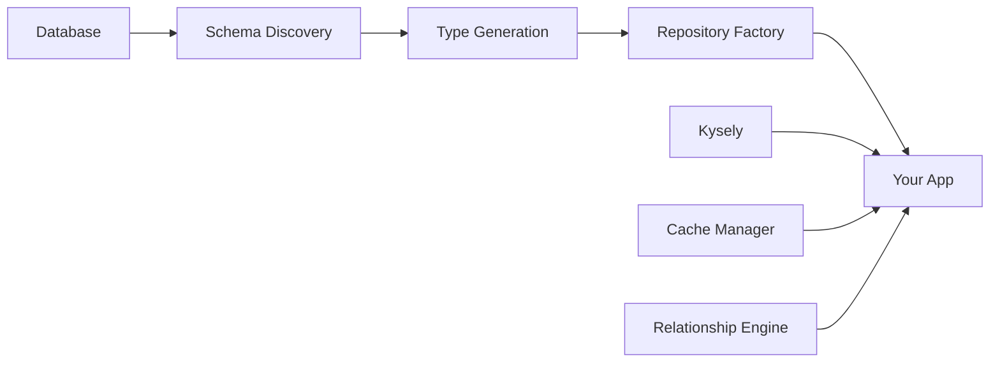

# NOORMME

> **No Pain, Everything to Gain** 🎯

[](https://badge.fury.io/js/noorm)
[](https://www.typescriptlang.org/)
[](https://opensource.org/licenses/MIT)
[](https://nodejs.org/)

Zero-configuration TypeScript ORM built on Kysely with automatic schema discovery, enhanced error handling, and best-in-class developer experience.

## ✨ Features

- **🔧 Zero Configuration** - Auto-loads from `.env`, no setup required
- **🔍 Smart Error Messages** - Context-aware errors with helpful suggestions
- **📊 Built-in Pagination** - Efficient pagination with metadata
- **🔗 Relationship Counting** - Get counts without N+1 queries
- **📱 CLI Tooling** - Project setup, schema inspection, type generation
- **⚡ Performance Monitoring** - Query analysis and N+1 detection
- **🔄 Schema Watching** - Auto-refresh on database changes
- **🧪 Testing Utilities** - In-memory SQLite, factories, helpers

## 🆚 Comparison with Other ORMs

| Feature | NOORMME | Prisma | TypeORM | Drizzle |
|---------|---------|--------|---------|---------|
| Zero Config | ✅ | ❌ | ❌ | ❌ |
| Enhanced Errors | ✅ | ❌ | ❌ | ❌ |
| Built-in Pagination | ✅ | ❌ | ⚠️ | ❌ |
| Relationship Counting | ✅ | ⚠️ | ⚠️ | ❌ |
| CLI Tooling | ✅ | ✅ | ⚠️ | ⚠️ |
| Schema Discovery | ✅ | ❌ | ✅ | ❌ |
| Performance Monitoring | ✅ | ❌ | ❌ | ❌ |
| Type Safety | ✅ | ✅ | ✅ | ✅ |

## 🚀 Quick Start

### 1. Install & Initialize

```bash
npm install noorm
npx noormme init
```

### 2. Use

```typescript
import { db } from './lib/db'

// Auto-discovers schema and relationships
await db.initialize()

// Type-safe repositories with enhanced features
const userRepo = db.getRepository('users')

// Smart pagination
const result = await userRepo.paginate({
  page: 1,
  limit: 20,
  where: { active: true },
  orderBy: { column: 'created_at', direction: 'desc' }
})

// Relationship counting (no N+1 queries)
const userWithCounts = await userRepo.withCount(1, ['posts', 'comments'])
// Returns: { id: 1, name: '...', postsCount: 5, commentsCount: 12 }
```

## Enhanced Developer Experience

### Before NOORMME
```typescript
// Generic errors, manual pagination, basic queries
const db = new ORM(process.env.DATABASE_URL)
const users = await db.user.findMany() // No context on errors
const count = await db.user.count()     // Separate query for count
```

### After NOORMME
```typescript
// Smart errors, built-in pagination, relationship insights
const db = new NOORMME() // Auto-loads from .env

// Helpful error: "Column 'emai' not found. Did you mean 'email'?"
const result = await userRepo.paginate({ page: 1, limit: 10 })
const userWithCounts = await userRepo.withCount(1, ['posts', 'comments'])
```

## Core Features

### 🔍 Enhanced Error Messages

Get helpful, context-aware error messages instead of cryptic database errors:

```typescript
try {
  await userRepo.findByEmai('test@example.com') // Typo
} catch (error) {
  // Error: Column 'emai' not found on table 'users'
  // Suggestion: Did you mean 'email'?
  // Available columns: id, name, email, age, active
}
```

### 📊 Built-in Pagination

Efficient, type-safe pagination with complete metadata:

```typescript
const result = await userRepo.paginate({
  page: 1,
  limit: 20,
  where: { active: true },
  orderBy: { column: 'created_at', direction: 'desc' }
})

// Returns:
// {
//   data: User[],
//   pagination: {
//     page: 1, limit: 20, total: 150, totalPages: 8,
//     hasNext: true, hasPrev: false
//   }
// }
```

### 🔗 Relationship Counting

Get relationship counts without loading related data:

```typescript
const user = await userRepo.withCount(userId, ['posts', 'comments'])
// { id: 1, name: 'John', postsCount: 5, commentsCount: 12 }
```

### 📱 CLI Tooling

Professional CLI for project setup and database inspection:

```bash
npx noormme init                    # Interactive project setup
npx noormme inspect users          # Detailed table inspection
npx noormme generate               # TypeScript type generation
```

### ⚡ Performance Monitoring

Built-in query analysis and performance warnings:

```typescript
db.enablePerformanceMonitoring({
  slowQueryThreshold: 1000,
  nPlusOneDetection: true,
  missingIndexDetection: true
})

// Automatic warnings:
// 🐌 Slow query detected: 1500ms
// 🔄 Potential N+1 query: same query executed 15 times
// 📇 Column 'email' used in WHERE clause may benefit from an index
```

### 🔄 Schema Watching

Monitor database changes in development:

```typescript
db.startSchemaWatching()

db.onSchemaChange((changes) => {
  console.log('Schema changes detected:', changes)
  // Auto-refreshes schema and regenerates types
})
```

## Available Methods

Every repository automatically includes:

- `findById(id)` - Find by primary key
- `findAll()` - Get all records
- `create(data)` - Create new record
- `update(entity)` - Update existing record
- `delete(id)` - Delete by primary key
- `count()` - Count total records
- `exists(id)` - Check if record exists
- `paginate(options)` - Paginated results
- `withCount(id, relations)` - Count related records
- Dynamic finders: `findByColumnName(value)`
- Dynamic list finders: `findManyByColumnName(value)`

## Database Support

- ✅ **SQLite** - Perfect for development, testing, and production

## Documentation

- [CLI Commands](./docs/cli.md) - Complete CLI reference
- [Error Handling](./docs/error-handling.md) - Error types and handling patterns
- [Pagination](./docs/pagination.md) - Pagination features and best practices
- [Relationships](./docs/relationships.md) - Relationship loading and optimization

## Examples

### Blog API

```typescript
// Get paginated posts with author information
const posts = await postRepo.paginate({
  page: 1,
  limit: 10,
  where: { published: true },
  orderBy: { column: 'created_at', direction: 'desc' }
})

// Get user with post and comment counts
const userStats = await userRepo.withCount(userId, ['posts', 'comments'])
```

### E-commerce

```typescript
// Product catalog with review counts
const products = await Promise.all(
  (await productRepo.findAll()).map(async product =>
    await productRepo.withCount(product.id, ['reviews'])
  )
)

// Order with related items
const order = await orderRepo.findWithRelations(orderId, ['items', 'customer'])
```

## 🧪 Testing Utilities

Comprehensive testing support:

```typescript
import { createTestDatabase, TestDataFactory } from 'noorm/testing'

const db = await createTestDatabase({ seed: true })
const factory = new TestDataFactory(db)

// Create test data easily
const user = await factory.createUser({ name: 'Test User' })
const posts = await factory.createPosts(user.id, 5)
```

## Performance

NOORMME is built for performance:

- **Efficient counting** - Uses `COUNT(*)` queries, not in-memory counting
- **Batch loading** - Prevents N+1 queries automatically
- **Smart pagination** - Optimized offset/limit queries
- **Query monitoring** - Built-in performance analysis
- **Index suggestions** - Automatic index recommendations

## 📚 Usage Examples

### Basic CRUD Operations

```typescript
const userRepo = db.getRepository('users')

// Create
const user = await userRepo.create({
  email: 'john@example.com',
  firstName: 'John',
  lastName: 'Doe'
})

// Read
const foundUser = await userRepo.findById(user.id)
const allUsers = await userRepo.findAll()

// Update
user.firstName = 'Johnny'
const updatedUser = await userRepo.update(user)

// Delete
await userRepo.delete(user.id)
```

### Working with Relationships

```typescript
// Load user with their posts
const userWithPosts = await userRepo.findWithRelations(user.id, ['posts'])

// Load nested relationships (posts with comments)
const userWithNested = await userRepo.findWithRelations(user.id, ['posts.comments'])

// Batch loading for performance
const users = await userRepo.findAll()
await userRepo.loadRelationships(users, ['posts', 'profile'])
```

### Custom Queries with Kysely

```typescript
// Use Kysely for complex queries
const activeUsers = await db
  .getKysely()
  .selectFrom('users')
  .where('active', '=', true)
  .selectAll()
  .execute()

// Raw SQL when needed
const result = await db.execute('SELECT * FROM users WHERE active = ?', [true])
```

### Transactions

```typescript
await db.transaction(async (trx) => {
  const user = await trx
    .insertInto('users')
    .values(userData)
    .returningAll()
    .executeTakeFirstOrThrow()
  
  await trx
    .insertInto('profiles')
    .values({ ...profileData, user_id: user.id })
    .execute()
})
```

### Database Migrations

```typescript
import { createNodeMigrationManager } from 'noorm'

// Create migration manager
const migrationManager = await createNodeMigrationManager(db, {
  migrationsDirectory: './migrations',
  migrationTimeout: 30000,
  maxConcurrentMigrations: 3
})

// Initialize and run migrations
await migrationManager.initialize()
const result = await migrationManager.migrate()

console.log(`Migrations: ${result.executed} executed, ${result.failed} failed`)
```

```sql
-- migrations/20241201120000_initial_schema.sql
CREATE TABLE IF NOT EXISTS users (
  id TEXT PRIMARY KEY,
  email TEXT UNIQUE NOT NULL,
  name TEXT NOT NULL,
  created_at TIMESTAMP DEFAULT CURRENT_TIMESTAMP
);

CREATE INDEX IF NOT EXISTS idx_users_email ON users(email);
```

## ⚙️ Configuration

### Basic Configuration

```typescript
const db = new NOORMME({
  dialect: 'sqlite'
  connection: {
    database: './myapp.db'
  }
})
```

### Advanced Configuration

```typescript
const db = new NOORMME({
  dialect: 'sqlite',
  connection: {
    database: './myapp.db'
  },
  introspection: {
    includeViews: true,
    excludeTables: ['migrations', 'sessions'],
    customTypeMappings: {
      'jsonb': 'Record<string, any>',
      'custom_type': 'CustomTypeInterface'
    }
  },
  cache: {
    ttl: 300000, // 5 minutes
    maxSize: 1000,
    strategy: 'lru'
  },
  logging: {
    level: 'info',
    enabled: true
  },
  performance: {
    enableQueryOptimization: true,
    enableBatchLoading: true,
    maxBatchSize: 100
  }
})
```

## 🎯 Supported Databases

| Database | Status | Features |
|----------|--------|----------|
| **SQLite** | ✅ Full Support | All features |

## 🔄 Migration from Other ORMs

### From TypeORM

```typescript
// Before (TypeORM)
const user = await userRepository.findOne({
  where: { id },
  relations: ['posts']
})

// After (NOORM)
const userRepo = db.getRepository('users')
const user = await userRepo.findWithRelations(id, ['posts'])
```

### From Prisma

```typescript
// Before (Prisma)
const user = await prisma.user.findUnique({
  where: { id },
  include: { posts: true }
})

// After (NOORM)
const userRepo = db.getRepository('users')
const user = await userRepo.findWithRelations(id, ['posts'])
```

### From Sequelize

```typescript
// Before (Sequelize)
const user = await User.findByPk(id, {
  include: [Post]
})

// After (NOORM)
const userRepo = db.getRepository('users')
const user = await userRepo.findWithRelations(id, ['posts'])
```

## 🚀 Performance Features

### Batch Loading

```typescript
// ❌ N+1 queries (slow)
const users = await userRepo.findAll()
for (const user of users) {
  await userRepo.loadRelationships(user, ['posts'])
}

// ✅ Batch loading (fast)
const users = await userRepo.findAll()
await userRepo.loadRelationships(users, ['posts'])
```

### Caching

```typescript
const db = new NOORMME({
  cache: {
    ttl: 300000, // 5 minutes
    maxSize: 1000,
    strategy: 'lru'
  }
})
```

### Performance Monitoring

```typescript
const metrics = db.getPerformanceMetrics()
console.log('Query count:', metrics.queryCount)
console.log('Average time:', metrics.averageQueryTime)
console.log('Cache hit rate:', metrics.cacheHitRate)
```

## 🎯 Perfect For

- **🚀 New Projects** - Start with full type safety from day one
- **🔄 Existing Projects** - Add to existing databases without migration
- **📱 Full-Stack Apps** - Works with any TypeScript/Node.js application
- **🏢 Enterprise** - Production-ready with connection pooling and monitoring
- **👥 Teams** - Consistent API reduces onboarding time

## 🏗️ Architecture

NOORM is built on top of [Kysely](https://kysely.dev), the type-safe SQL query builder, and follows a simple architecture:



## 📖 Documentation

- **[Architecture Proposal](./architecture-proposal/)** - Complete system design and implementation details
- **[Examples](./examples/)** - Real-world usage patterns
- **[Migration Guide](./architecture-proposal/MIGRATION_GUIDE.md)** - Migrate from other ORMs
- **[Getting Started](./architecture-proposal/GETTING_STARTED.md)** - 5-minute setup guide

### 🗃️ Migration System

NOORM includes a comprehensive, production-ready migration system:

- **[Migration System Overview](./MIGRATION_SYSTEM_CLEAN.md)** - Clean architecture and design principles
- **[Migration Usage Examples](./MIGRATION_USAGE_EXAMPLE.md)** - Complete usage patterns and best practices
- **[Node.js Implementation](./MIGRATION_NODE_IMPLEMENTATION.md)** - Full Node.js integration details
- **[Migration Files](./migrations/README.md)** - SQL migration file format and conventions

## 🤝 Contributing

We welcome contributions! Here's how to get started:

1. **Read the docs** - Start with the [Architecture Proposal](./architecture-proposal/)
2. **Check issues** - Look for "good first issue" labels
3. **Follow guidelines** - TypeScript best practices, test coverage
4. **Submit PR** - Include tests and documentation updates

### Development Setup

```bash
# Clone the repository
git clone https://github.com/CardSorting/NOORM.git
cd NOORM

# Install dependencies
pnpm install

# Build the project
pnpm build

# Run tests
pnpm test
```

## 📞 Need Help?

- **📖 Documentation** - Comprehensive guides in the [architecture-proposal](./architecture-proposal/) directory
- **🐛 Issues** - [GitHub Issues](https://github.com/CardSorting/NOORM/issues) for bugs
- **💬 Discussions** - [GitHub Discussions](https://github.com/CardSorting/NOORM/discussions) for questions
- **💡 Ideas** - [Feature Requests](https://github.com/CardSorting/NOORM/discussions/categories/ideas)

## 📄 License

MIT License - see [LICENSE](./LICENSE) file for details.

## 🙏 Acknowledgments

- Built on top of [Kysely](https://kysely.dev) - the amazing type-safe SQL query builder
- Inspired by the simplicity of modern database tools
- Thanks to all contributors and the TypeScript community

---

**Ready to get started?** Check out the [examples](./examples/) directory for real-world usage patterns!

<div align="center">

**Made with ❤️ by the NOORM team**

[Documentation](./architecture-proposal/) • [Examples](./examples/) • [GitHub](https://github.com/CardSorting/NOORM)

</div>
