# NOORMME Architecture Diagram

> **Visual guide to NOORMME's system architecture**

This document provides visual diagrams and explanations of how NOORMME works internally.

## 📚 Navigation

- **[GETTING_STARTED.md](./GETTING_STARTED.md)** - 5-minute setup guide
- **[DEVELOPER_GUIDE.md](./DEVELOPER_GUIDE.md)** - Comprehensive documentation
- **[QUICK_REFERENCE.md](./QUICK_REFERENCE.md)** - Common operations
- **[MIGRATION_GUIDE.md](./MIGRATION_GUIDE.md)** - Migration from other ORMs
- **[TROUBLESHOOTING.md](./TROUBLESHOOTING.md)** - Common issues and solutions
- **[examples/](./examples/)** - Real-world usage patterns

## 🏗️ System Architecture Overview

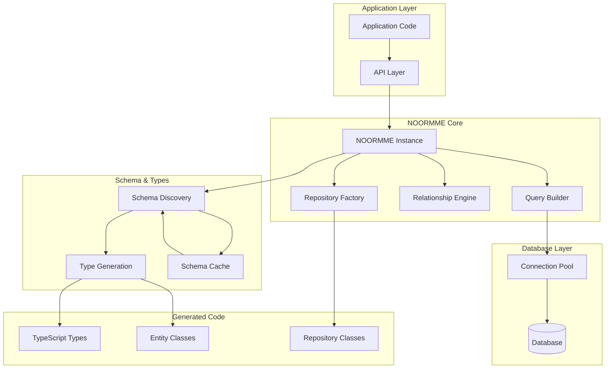

## 🔄 Data Flow Diagram

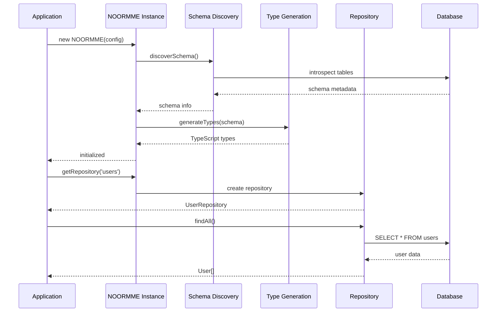

## 🎯 Component Interaction Diagram

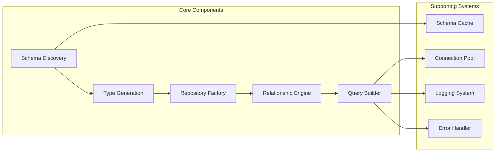

## 📊 Repository Pattern Diagram

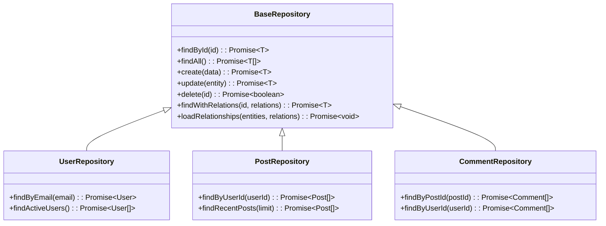

## 🔗 Relationship Loading Diagram

```mermaid
graph TD
    subgraph "User Request"
        REQ[findWithRelations(userId, ['posts.comments'])]
    end
    
    subgraph "Relationship Engine"
        PARSE[Parse relationship path]
        LOAD1[Load user posts]
        LOAD2[Load post comments]
        MERGE[Merge relationships]
    end
    
    subgraph "Database Queries"
        Q1[SELECT * FROM posts WHERE user_id = ?]
        Q2[SELECT * FROM comments WHERE post_id IN ?]
    end
    
    REQ --> PARSE
    PARSE --> LOAD1
    LOAD1 --> Q1
    Q1 --> LOAD2
    LOAD2 --> Q2
    Q2 --> MERGE
    MERGE --> REQ
```

## 🎨 Type Generation Flow

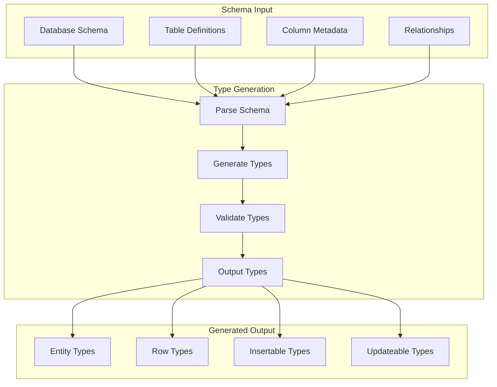

## 🚀 Initialization Process

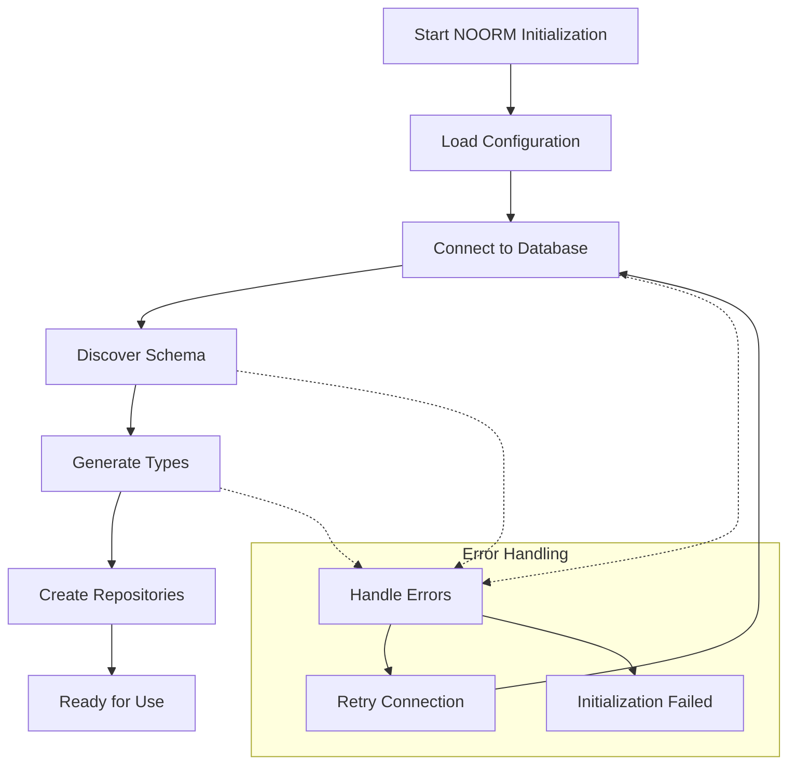

## 🔧 Configuration Architecture

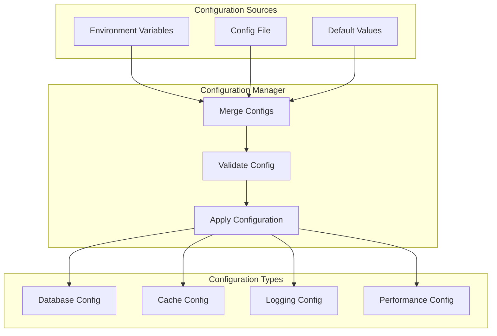

## 📈 Performance Monitoring

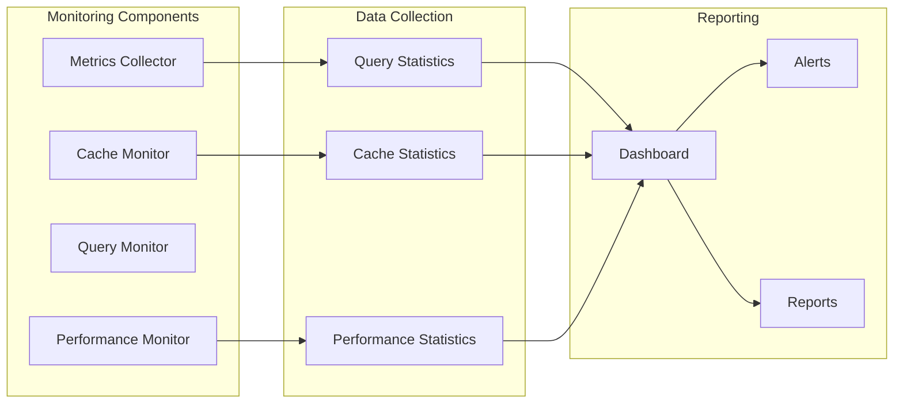

## 🎯 Migration Path

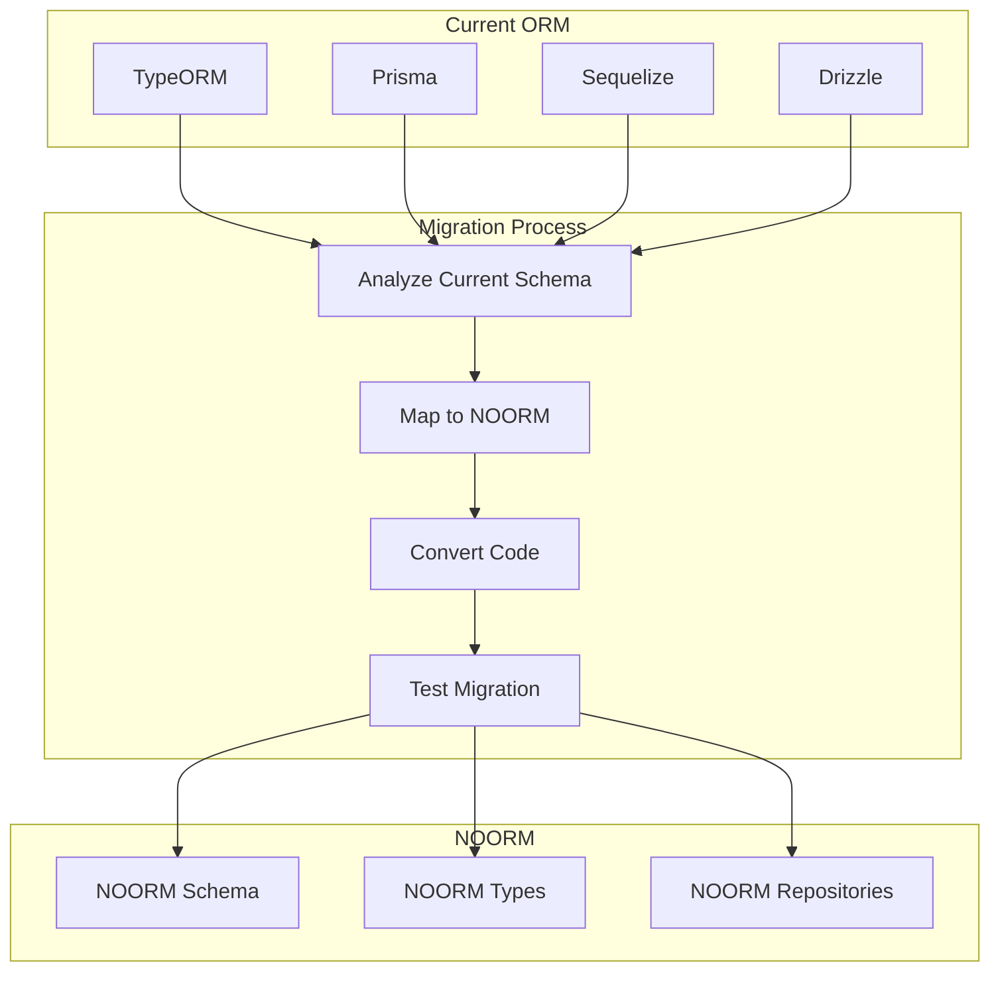

## 🔄 Schema Evolution

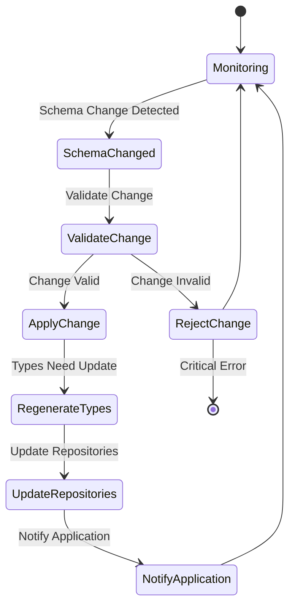

## 🎨 Developer Experience Flow

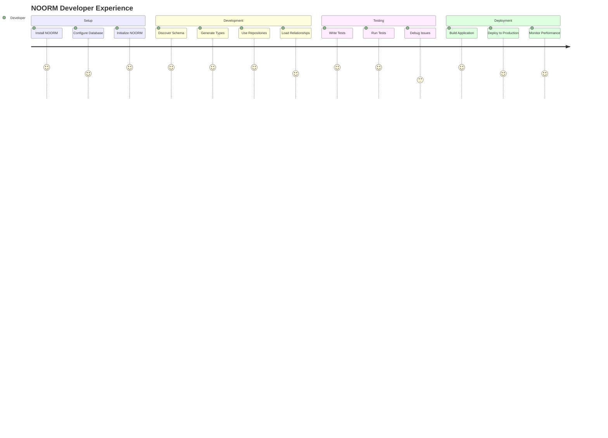

---

**Note:** These diagrams use Mermaid syntax and can be rendered in GitHub, GitLab, and other Markdown viewers that support Mermaid.
