# DreamBeeSQL Architecture Diagrams

## 🎯 System Overview

## 🔍 Component Architecture

## 🔄 Data Flow Diagrams

### Initialization Flow

### Runtime Operation Flow

### Schema Evolution Flow

## 🏗️ Database Schema Discovery

## 🎨 Type Generation Process

## 🔗 Relationship Detection

```mermaid
graph TD
    subgraph "Database Tables"
        USERS[Users Table]
        POSTS[Posts Table]
        COMMENTS[Comments Table]
        PROFILES[Profiles Table]
    end
    
    subgraph "Foreign Keys"
        FK1[posts.user_id → users.id]
        FK2[comments.post_id → posts.id]
        FK3[comments.user_id → users.id]
        FK4[profiles.user_id → users.id]
    end
    
    subgraph "Detected Relationships"
        REL1[User hasMany Posts]
        REL2[User hasMany Comments]
        REL3[User hasOne Profile]
        REL4[Post belongsTo User]
        REL5[Post hasMany Comments]
        REL6[Comment belongsTo Post]
        REL7[Comment belongsTo User]
        REL8[Profile belongsTo User]
    end
    
    USERS --> FK1
    USERS --> FK3
    USERS --> FK4
    POSTS --> FK2
    
    FK1 --> REL1
    FK1 --> REL4
    FK2 --> REL5
    FK2 --> REL6
    FK3 --> REL2
    FK3 --> REL7
    FK4 --> REL3
    FK4 --> REL8
```

## 💾 Caching Strategy

## 🚨 Error Handling Flow

## 📊 Performance Monitoring

## 🔧 Configuration Management

## 🎯 Usage Patterns

### Basic Usage Pattern

### Advanced Usage Pattern

## 🎨 Visual Summary

These diagrams illustrate the complete DreamBeeSQL architecture, from high-level system overview to detailed component interactions. The visual representation helps developers understand:

1. **System Architecture** - How components interact
2. **Data Flow** - How information moves through the system
3. **Process Flow** - Step-by-step operations
4. **Error Handling** - How errors are managed
5. **Performance** - How the system is optimized
6. **Configuration** - How settings are managed
7. **Usage Patterns** - How developers interact with the system

The diagrams use Mermaid syntax, making them easy to maintain and update as the architecture evolves.
