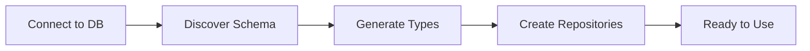

# NOORMME Architecture Proposal

> **Zero-configuration pseudo-ORM that works with any existing database**

NOORMME automatically discovers your database schema and generates TypeScript types, entities, and repositories. No manual entity definitions required!

## 🎯 Why NOORMME?

| Feature | Traditional ORMs | NOORMME |
|---------|------------------|---------|
| Setup | Complex configuration | Zero configuration |
| Schema | Manual entity definitions | Auto-discovered |
| Types | Manual type definitions | Auto-generated |
| Migration | Schema migration files | Works with existing DB |
| Learning Curve | Steep | Minimal |
| Developer Experience | Complex setup | Instant productivity |

## 🚀 Get Started in 2 Minutes

### 1. Install
```bash
npm install noormme
```

### 2. Connect
```typescript
import { NOORMME } from 'noormme'

const db = new NOORMME({
  dialect: 'postgresql',
  connection: {
    host: 'localhost',
    port: 5432,
    database: 'myapp',
    username: 'user',
    password: 'password'
  }
})

await db.initialize()
```

### 3. Use
```typescript
const userRepo = db.getRepository('users')
const users = await userRepo.findAll()
// ✅ Full TypeScript support, IntelliSense, type safety
```

**That's it!** NOORMME automatically:
- ✅ Discovers all tables and relationships
- ✅ Generates TypeScript types
- ✅ Creates repository classes with CRUD operations
- ✅ Provides full IntelliSense support

## 📚 Documentation

### 🎯 Start Here
- **[GETTING_STARTED.md](./GETTING_STARTED.md)** - 5-minute setup guide
- **[DEVELOPER_GUIDE.md](./DEVELOPER_GUIDE.md)** - Complete guide with examples
- **[QUICK_REFERENCE.md](./QUICK_REFERENCE.md)** - Common operations cheat sheet

### 🔄 Migration
- **[MIGRATION_GUIDE.md](./MIGRATION_GUIDE.md)** - Migrate from TypeORM, Prisma, Sequelize

### 🛠️ Advanced
- **[TYPESCRIPT_CHEAT_SHEET.md](./TYPESCRIPT_CHEAT_SHEET.md)** - TypeScript patterns
- **[TROUBLESHOOTING.md](./TROUBLESHOOTING.md)** - Common issues and solutions
- **[ARCHITECTURE_DIAGRAM.md](./ARCHITECTURE_DIAGRAM.md)** - System architecture

### 📁 Examples
- **[examples/](./examples/)** - Real-world usage patterns
- **[legacy-components/](./legacy-components/)** - Implementation details

## 🏗️ How It Works

NOORMME uses a simple 5-step process:



1. **Connect** - Point NOORMME to your existing database
2. **Discover** - Automatically introspect tables and relationships
3. **Generate** - Create TypeScript types and interfaces
4. **Create** - Build repository classes with CRUD operations
5. **Use** - Start coding with full type safety

## 💡 Key Benefits

- **🚀 Instant Setup** - Works with any existing database without configuration
- **🔒 Type Safety** - Full TypeScript support with auto-generated types
- **⚡ Performance** - Built on Kysely for optimal SQL generation
- **🔄 Zero Migration** - No need to restructure your existing database
- **📚 Familiar API** - Repository pattern that developers already know

## 🎯 Supported Databases

| Database | Status | Features |
|----------|--------|----------|
| PostgreSQL | ✅ Full Support | All features |
| MySQL | ✅ Full Support | All features |
| SQLite | ✅ Full Support | All features |
| MSSQL | 🚧 In Progress | Basic support |

## 📋 Implementation Status

### ✅ Phase 1: Core (Complete)
- Schema discovery and introspection
- Type generation from database schema
- Basic repository pattern with CRUD
- PostgreSQL, MySQL, SQLite support

### 🚧 Phase 2: Relationships (In Progress)
- One-to-many and many-to-one relationships
- Nested relationship loading
- Batch loading for performance

### 📅 Phase 3: Advanced (Planned)
- Many-to-many relationships
- Custom validation rules
- Performance optimizations
- Migration tools

## 🤝 Contributing

We welcome contributions! Here's how to get started:

1. **Read the docs** - Start with [GETTING_STARTED.md](./GETTING_STARTED.md)
2. **Check issues** - Look for "good first issue" labels
3. **Follow guidelines** - TypeScript best practices, test coverage
4. **Submit PR** - Include tests and documentation updates

## 🎯 Perfect For

- **🚀 New Projects** - Start with full type safety from day one
- **🔄 Existing Projects** - Add to existing databases without migration
- **📱 Full-Stack Apps** - Works with any TypeScript/Node.js application
- **🏢 Enterprise** - Production-ready with connection pooling and monitoring
- **👥 Teams** - Consistent API reduces onboarding time

## 📞 Need Help?

- **📖 Documentation** - Comprehensive guides in this directory
- **🐛 Issues** - [GitHub Issues](https://github.com/your-org/noormme/issues) for bugs
- **💬 Discussions** - [GitHub Discussions](https://github.com/your-org/noormme/discussions) for questions
- **💡 Ideas** - [Feature Requests](https://github.com/your-org/noormme/discussions/categories/ideas)

---

**Ready to get started?** Jump to **[GETTING_STARTED.md](./GETTING_STARTED.md)** for a 5-minute setup guide!